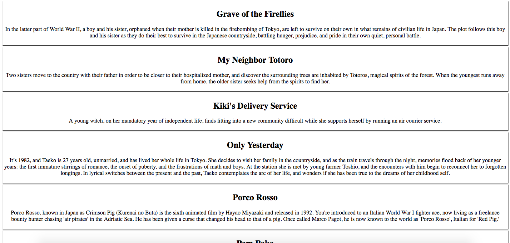

# API Practice

### Choose one:

- [Rick and Morty API](https://rickandmortyapi.com/)

Read the documentation of the rick and morty api and display the name and image of the main family of Rick and Morty on your HTML page. 

> Hint: their ids start from 1 to 5

---

- [Studio Ghibli API](https://ghibliapi.herokuapp.com/)

Read the documentation of the studio ghibli api and display the title and description of their films on your HTML page.

